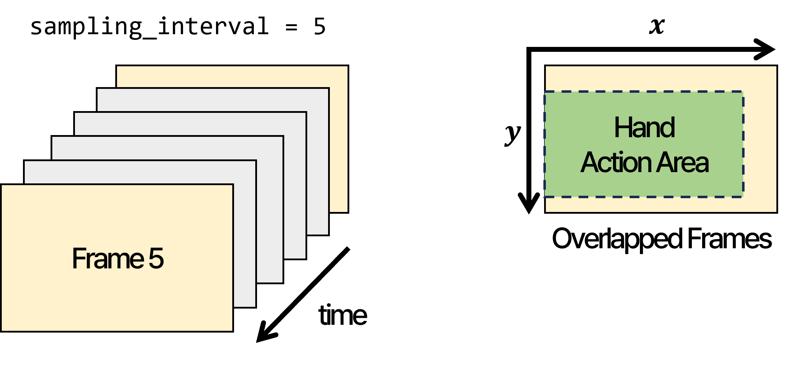
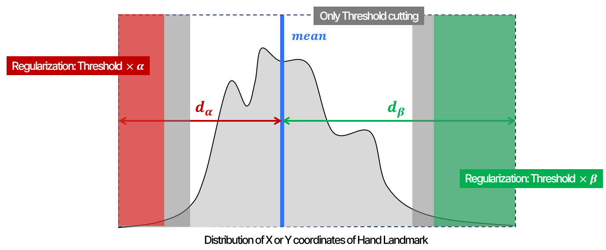
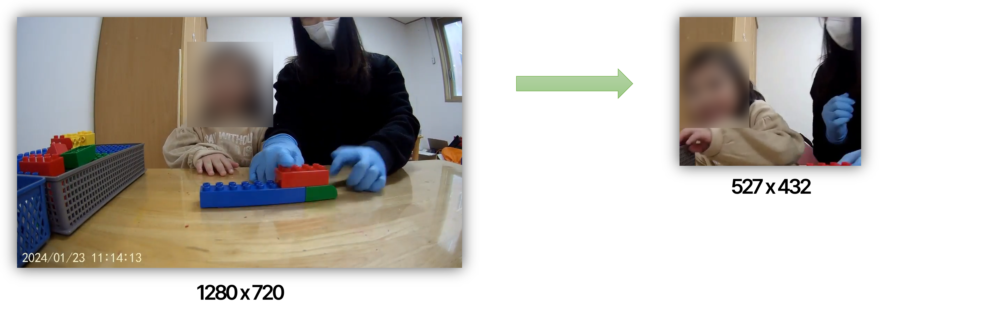

# **Human-centric Video Crop Algorithm**

## **I.** Intro
To accurately detect preschoolers block building behavior, we implemented a cropping algorithm that better reflects the target's radius of action while appropriately removing surrounding objects.

## **II.** Architecture Details

### Step1. Find Hand Action Area
**Hand Action Area** *defined by*  
**"A rectangular are containing all hand-landmarks which detected in the input video"**  
So, Check all hand-landmarks in the video per sampling interval and Save them.
  


### Step2. Regularize
Note that this algorithm cut video by pre-decided threshold (e.g. 0.02 = 2%)  
However, Crop only by threshold *DO NOT* consider a variance of total data distribution.  
This implies that the algorithm *don't care* **human body position in XY-coordinates of the input video.**  

So, To compensate for some of the error in the output due to outliers,  
We add some a regularization operation calculated with proportional factor based on human body position.  

$$
\begin{align*}
&d := \text{distance in XY-coordinates}  \\ 
&\alpha := {d_{\alpha} \over d_{\alpha} + d_{\beta}} \\ 
&\beta := {d_{\beta} \over d_{\alpha} + d_{\beta}} \\
&(\text{Note that } \alpha, \beta \text{ satisfy proporties of probability.})  
\end{align*}
$$  



### Step3. Crop and save it
After *Step2*, We get a crop area. So, Just crop and save.  
Remark that the name of saved file is determined automatically.  
e.g. `input.mp4` to `input_cropped.mp4`  

> __*Remark*__  
We do not crop in 𝜶 direction (Upper area of video) with respect to Y coordinates.  
Because Some videos contains ‘stand up action’.



## III. Environment Set-up

### Step1. Download this python script
Use `git clone` or directly download.
Then you can get a below hierarchy.
```
crop
├── data
│   └── your_video.mp4
├── image
├── crop.py
├── README.md
└── requirements.txt
```


### Step2. Create anaconda virtual environment
```
(base) ~/crop> conda create -n env_name
(base) ~/crop> conda activate env_name
(env_name) ~/crop> conda install python=3.10.13
(env_name) ~/crop> pip install -r requirements.txt
```

### Step3. Run & test
```
(env_name) ~/crop> python crop.py -n ./data/your_video.mp4
```
*or*
```
(env_name) ~/crop> python crop.py --filepath ./data/your_video.mp4
```

## IV. Requirements
```
python=3.10.13
opencv-python=4.9.0.80
numpy=1.26.3
tqdm=4.66.2
mediapipe=0.10.9
```